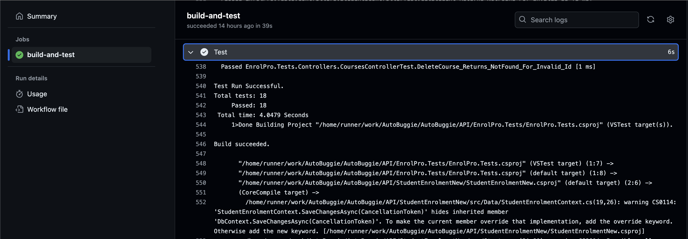
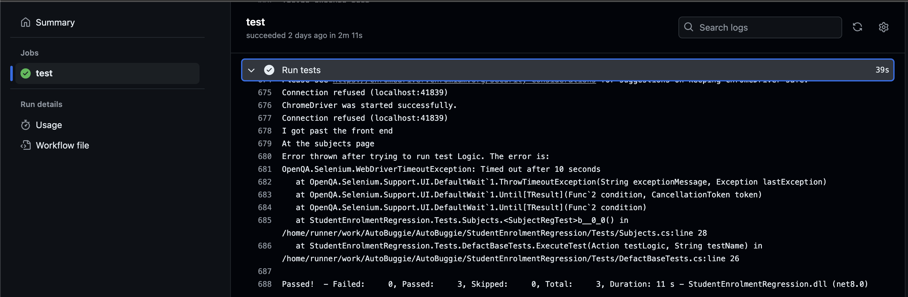
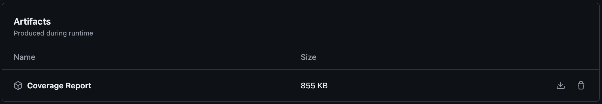
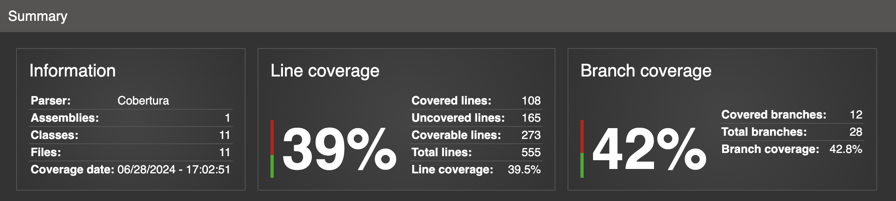
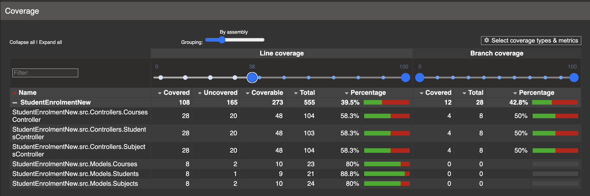
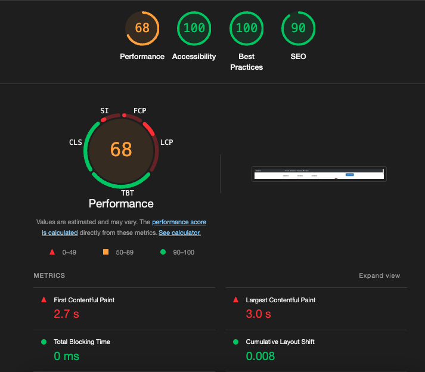
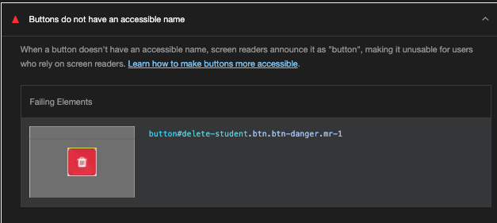

# ADA SQA part 2 - EnrollPro

## Overview

### Project Description 
EnrollPro is a comprehensive student management system designed for educational institutions. It allows administrators and teachers to manage students, courses, and subjects efficiently. The system consists of the following core components:

1. Students: Each student has a unique ID, first name, and last name.
2. Courses: Each course has a unique ID, name, and description.
3. Subjects: Each subject has a unique ID, name, description, and a connection with a course.

Relationships:
- Students can be enrolled in multiple courses (many-to-many relationship).
- Courses can contain multiple subjects (one-to-many relationship).
- Students can be associated with multiple subjects through their course enrollments.

### Key Features 

Frontend:
* View lists of students, courses, and subjects
* Add new students, courses, and subjects via modal interfaces
* Delete existing students, courses, and subjects
* Navigate between different sections (Home, Students, Courses, Subjects)
* Responsive design for various screen sizes

Backend (assumed based on frontend functionality):
* Student Management: Create, read, update, and delete (CRUD) student records
* Course Management: CRUD operations for courses
* Subject Management: CRUD operations for subjects
* Data persistence: Store and retrieve data from a database
* API endpoints to serve data to the frontend

### Requirements 

1. Student Management:
   * Each student must have a unique Student ID
   * First name and last name are mandatory fields for student creation
   * Students can be added, viewed, and deleted from the system

2. Course Management:
   * Each course must have a unique Course ID
   * Course name and description are required fields
   * Courses can be added, viewed, and deleted from the system

3. Subject Management:
   * Each subject must have a unique Subject ID
   * Subject name and description are mandatory fields
   * Subjects can be added, viewed, and deleted from the system

4. User Interface:
   * The application must provide a clear and intuitive navigation menu
   * Adding new entries (students, courses, subjects) should be done through modal interfaces
   * Lists of students, courses, and subjects should be displayed in a tabular format
   * Delete functionality should be available for each entry in the lists

5. Data Integrity:
   * The system must prevent duplicate entries based on unique IDs
   * When deleting a course or subject, the system should handle related data appropriately (e.g., removing enrollments or updating student records)

6. Responsiveness:
   * The application must be usable on various device sizes, from mobile phones to desktop computers

### Demo
[](https://www.youtube.com/watch?v=tB2YVyBBHgY)

## Team Description 
This project was developed as a solo effort. As the sole developer, I took on multiple roles throughout the development process:

- Project Manager: Planning the project scope, timeline, and deliverables.
- Full-stack Developer: Implementing both frontend and backend functionality.
- UI/UX Designer: Creating the user interface and ensuring a smooth user experience.
- Quality Assurance Tester: Developing and executing test cases to ensure software quality.
- DevOps Engineer: Setting up the CI pipeline and managing version control.

Contribution: 100% of the project was completed by me, taking on all aspects of development, testing, and documentation.

## Tools Used

### Version Control
- Git
- GitHub

### Development Stack
#### Frontend
- Angular (TypeScript)

#### Backend
- C# .NET

### Testing
| Tool | Purpose | Documentation |
|------|---------|---------------|
| XUnit | Backend unit testing | [XUnit Docs](https://xunit.net/) |
| MOQ | Mocking framework for .NET. Used to support unit tests| [MOQ Docs](https://github.com/moq/moq4) |
| Selenium | UI automated testing | [Selenium Docs](https://www.selenium.dev/documentation/) |

#### Test Code Coverage
Automatic coverage reports have been configured for pull requests using [Coverlet](https://github.com/coverlet-coverage/coverlet), a code coverage tool for .NET projects. To view the coverage reports, go to the **Actions** tab in GitHub, select the relevant **API unit test** workflow run, and download the coverage report artifact. Open the `index.html` file within the downloaded artifact to view detailed coverage metrics.

### Linters and Code Quality Tools
- [StyleCop Analyzers](https://github.com/DotNetAnalyzers/StyleCopAnalyzers) for C# code style enforcement

This nuget dependency is automatically ran on every build, as well as locally. It will give warnings about improving code standards and quality, and if configured, allows me to apply my own custom rules for my project.

### Project Management
A lightweight Kanban board was implemented using [Todoist](https://todoist.com/help/articles/use-the-board-layout-in-todoist-AiAVsyEI), a task management application primarily designed for individuals.

### Performance and Accessibility Audit
| Tool | Purpose | Documentation |
|------|---------|---------------|
| Lighthouse | Web page quality analysis | [Lighthouse Docs](https://developers.google.com/web/tools/lighthouse) |

### Continuous Integration
- GitHub Actions for CI pipelines

### Database
- SQL Server for data persistence in the backend

### API Documentation
- Swagger UI for API documentation and testing in the "Docs" folder of the API solution. 

## Instructions
First, clone the repository. You can use `git clone <repo url>`. To find other ways to clone the repository, such as directly opening it on GitHub Desktop, click on the green "Code" button at the top right of the repository page on GitHub.

This mono repository consists of several "sub-projects":

```
EnrolPro
├── API
│   ├── EnrolPro.Tests
│   └── EnrolPro
├── FrontEnd
└── EnrolProRegression
```

These sub-projects include:

- **API**: Contains the backend API and unit tests.
- **FrontEnd**: Holds the frontend application.
- **EnrolProRegression**: Holds the UI selenium regression testing solution.

For instructions on how to run each of these projects, navigate to the respective folder and follow the guidelines in the README file. There are five README files in total within this repository, including this one. 

## Test Methodologies and Execution

### Types of Testing

| Testing Type | Purpose |
|--------------|---------|
| Unit Testing | To verify the correctness of individual components in isolation, done for all methods and controllers in the API. This ensures that each function behaves as expected and helps catch issues early in the development process. |
| UI Testing   | To simulate user interactions and verify that the frontend behaves correctly from an end-user perspective. This helps ensure a smooth user experience and catches integration issues that might not be apparent in unit tests. |

### Backend Unit Test Scenarios

#### `CoursesController.cs` Tests

| ID | Scenario | Purpose |
|----|----------|---------|
| BC1 | Get All Courses | Verify that the API can retrieve all courses correctly |
| BC2 | Get Course by ID | Ensure that a specific course can be retrieved using its ID |
| BC3 | Get Non-existent Course | Confirm that the API handles requests for non-existent courses appropriately |
| BC4 | Create New Course | Validate that new courses can be created successfully |
| BC5 | Delete Existing Course | Verify that courses can be deleted correctly |
| BC6 | Delete Non-existent Course | Ensure proper handling of delete requests for non-existent courses |


#### `StudentsController.cs` Tests

| ID   | Scenario                      | Purpose                                                                  |
|------|-------------------------------|--------------------------------------------------------------------------|
| ST1  | Get All Students              | Verify that the API can retrieve all students correctly                  |
| ST2  | Get Student by ID             | Ensure that a specific student can be retrieved using its ID             |
| ST3  | Get Non-existent Student      | Confirm that the API handles requests for non-existent students properly |
| ST4  | Create New Student            | Validate that new students can be added successfully                     |
| ST5  | Delete Existing Student       | Verify that students can be deleted correctly                            |
| ST6  | Delete Non-existent Student   | Ensure proper handling of delete requests for non-existent students      |

#### `SubjectsController.cs` Tests

| ID   | Scenario                      | Purpose                                                                   |
|------|-------------------------------|---------------------------------------------------------------------------|
| SB1  | Get All Subjects              | Verify that the API can retrieve all subjects correctly                   |
| SB2  | Get Subject by ID             | Ensure that a specific subject can be retrieved using its ID              |
| SB3  | Get Non-existent Subject      | Confirm that the API handles requests for non-existent subjects properly  |
| SB4  | Create New Subject            | Validate that new subjects can be created successfully                    |
| SB5  | Delete Existing Subject       | Verify that subjects can be deleted correctly                             |
| SB6  | Delete Non-existent Subject   | Ensure proper handling of delete requests for non-existent subjects       |`

### UI Test Scenarios

#### Courses Page Tests

| ID | Scenario | Purpose |
|----|----------|---------|
| UC1 | Navigate to Courses Page | Verify that users can access the Courses page from the main navigation |
| UC2 | View Courses List | Ensure that the course table is populated with existing courses |
| UC3 | Add New Course | Validate that a new course can be added through the UI |
| UC4 | Delete Existing Course | Confirm that a course can be removed from the list |
| UC5 | Verify Table Updates | Check that the course table updates correctly after additions and deletions |

#### Students Page Tests

| ID | Scenario | Purpose |
|----|----------|---------|
| US1 | Navigate to Students Page | Verify that users can access the Students page from the main navigation |
| US2 | View Students List | Ensure that the student table is populated with existing students |
| US3 | Add New Student | Validate that a new student can be added through the UI |
| US4 | Delete Existing Student | Confirm that a student can be removed from the list |
| US5 | Verify Table Updates | Check that the student table updates correctly after additions and deletions |

#### Subjects Page Tests

| ID | Scenario | Purpose |
|----|----------|---------|
| UB1 | Navigate to Subjects Page | Verify that users can access the Subjects page from the main navigation |
| UB2 | View Subjects List | Ensure that the subject table is populated with existing subjects |
| UB3 | Add New Subject | Validate that a new subject can be added through the UI |
| UB4 | Delete Existing Subject | Confirm that a subject can be removed from the list |
| UB5 | Verify Table Updates | Check that the subject table updates correctly after additions and deletions |

### Test Execution
Here’s how tests are conducted throughout the development lifecycle:

- **Pre-Push Testing**:
  - **Unit Testing**: Prior to pushing changes, I try to run my unit test solution. This helps avoid errors in the pipeline and catching them early, but as the amount of unit tests grow, this might be more suitable to only be conducted in the pipeline
  - **Manual Endpoint Testing**: Initially, I used Postman to manually test all endpoints. As the number of endpoints grew, this method became time-consuming and less efficient, this made me re-think my testing strategy and create a CI pipeline to ensure quality and led me to ONLY do smoke testing in pre-push.
  - **Smoke Testing**: A quick smoke test is performed by calling the health endpoint to ensure the API is operational at a basic level. This check confirms that the core functions of the application are working correctly before changes are pushed. As the unit tests only check the business logic, and not problems in the start up of the API, this strategy ensures the API works before reaching my CI pipeline and environment. 

- **Transition to CI Pipeline**:
  - **Unit Testing**: Due to the increasing complexity and number of endpoints, the manual testing approach was re-evaluated. To save time and enhance test coverage, a shift was made towards automating these tests within the Continuous Integration (CI) pipeline. Now, upon initiating a pull request, the CI pipeline runs all unit tests to verify backend logic.
  - **UI Testing**: In addition to backend tests, the CI pipeline also conducts UI tests to verify the front-end interaction and presentation. This ensures that the front-end is working correctly as well as the endpoints it interacts with.

#### Tests evidence
##### Unit tests


##### UI tests


#### Test coverage report
I have configured my unit tests pipeline to automatically generate a coverage document, and to be uploaded to the artifacts section after each run. This allows developers to check if they have covered all aspects of the code and to quickly identify if they have forgotten to test their new features/code. 





## Coding Best Practices

### Architecture Best Practice: MVC

In my application, I have implemented the Model-View-Controller (MVC) architectural pattern, which is a well-established best practice for structuring web applications. The MVC pattern separates the application into three interconnected components:

- **Model**: Represents the data and the business logic.
- **View**: Represents the user interface.
- **Controller**: Handles the user input and interacts with the model and the view.

#### Implementation

**Controller Example:**
```csharp
[ApiController]
[Route("api/[controller]")]
public class CoursesController : ControllerBase
{
    private readonly IStudentEnrolmentContext _context;

    public CoursesController(IStudentEnrolmentContext context)
    {
        _context = context;
    }

    [HttpGet]
    public async Task<ActionResult<IEnumerable<Courses>>> GetCourses()
    {
        return Ok(await _context.Course.ToListAsync());
    }
}
```

**Model Example:**
```csharp
public class Courses
{
    [Key]
    [DatabaseGenerated(DatabaseGeneratedOption.Identity)]
    public int CourseId { set; get; }
    public string CourseName { set; get; }
    public string CourseDescription { set; get; }
    public ICollection<Subjects>? Subjects { get; set; }
    public IList<CourseMembership>? CourseMemberships { get; set; }

    public Courses(string CourseName, string CourseDescription)
    {
        this.CourseName = CourseName;
        this.CourseDescription = CourseDescription;
    }
}
```


**View**: Since this is an API, the view layer is not explicitly implemented as in traditional MVC applications. The client (my angular front-end) acts as the view layer, consuming the API endpoints.

#### Benefits

- **Separation of Concerns**: By dividing the application into three distinct layers, I ensure that each component handles its specific responsibilities. This makes the codebase easier to understand and maintain.
- **Scalability**: The modular nature of MVC allows me to scale each component independently. For instance, I can enhance the data models or add more controllers without affecting other parts of the application.
- **Testability**: The separation makes unit testing more straightforward, as I can test each component in isolation.

### Dependency Injection

Dependency Injection (DI) is a design pattern used to implement IoC (Inversion of Control), allowing the creation of dependent objects outside of a class and providing those objects to a class in different ways. DI helps to decouple the dependencies between classes, improving the maintainability and testability of the application.

#### Implementation

In my application, I use DI to inject the `IStudentEnrolmentContext` into my controllers, ensuring that the controllers do not directly depend on the concrete implementation of the context.

**Example:**
```csharp
public class CoursesController : ControllerBase
{
    private readonly IStudentEnrolmentContext _context;

    public CoursesController(IStudentEnrolmentContext context)
    {
        _context = context;
    }
}
```

**Service Registration:**
```csharp
public void ConfigureServices(IServiceCollection services)
{
    services.AddDbContext<StudentEnrolmentContext>(options => 
        options.UseSqlServer(Configuration.GetConnectionString("DefaultConnection")));
    services.AddScoped<IStudentEnrolmentContext, StudentEnrolmentContext>();
    services.AddControllers();
}
```

#### Benefits

- **Loose Coupling**: DI allows me to inject dependencies, making my classes less dependent on concrete implementations and more flexible.
- **Mocking for Testing**: By using interfaces and DI, I can easily mock dependencies in unit tests, leading to better isolation and more effective testing.
  
**Example of Mocking in Tests:**
```csharp
var mockContext = new Mock<IStudentEnrolmentContext>();
mockContext.Setup(c => c.Course.FindAsync(It.IsAny<int>())).ReturnsAsync(new Courses("Test Course", "Test Description"));
```

### Other Best Practices

#### Naming Conventions

Using clear and consistent naming conventions is crucial for maintaining readable and understandable code. For instance, my class names are in PascalCase (`Courses`, `Students`), and method names are also in PascalCase (`GetCourses`, `PostCourse`). This consistency helps in quickly understanding the purpose and functionality of different components in the codebase.

**Example:**
```csharp
public async Task<ActionResult<Courses>> GetCourse(int id)
{
    var course = await _context.Course.FindAsync(id);
    if (course == null)
    {
        return NotFound();
    }
    return course;
}
```

#### Entity Configuration

Configuring entities in `OnModelCreating` method centralises model configurations, ensuring that all entity relationships and constraints are clearly defined and managed in one place.

**Example:**
```csharp
protected override void OnModelCreating(ModelBuilder modelBuilder)
{
    base.OnModelCreating(modelBuilder);

    modelBuilder.Entity<Courses>(entity =>
    {
        entity.Property(e => e.CourseName).IsRequired();
        entity.Property(e => e.CourseDescription).IsRequired();
        entity.HasKey(e => e.CourseId);
    });
}
```

#### Error Handling

Implementing robust error handling ensures that the application can gracefully handle exceptions and provide meaningful error messages to the client. For instance, checking for `null` values and returning appropriate HTTP status codes helps in maintaining a predictable API behaviour.

**Example:**
```csharp
public async Task<IActionResult> PutCourse(int id, Courses course)
{
    if (id != course.CourseId)
    {
        return BadRequest();
    }

    _context.Entry(course).State = EntityState.Modified;

    try
    {
        await _context.SaveChangesAsync();
    }
    catch (DbUpdateConcurrencyException)
    {
        if (!CourseExists(id))
        {
            return NotFound();
        }
        else
        {
            throw;
        }
    }

    return NoContent();
}
```

## CI Pipeline

EnrollPro has two GitHub Actions pipelines to automate testing and ensure the quality of both the frontend and backend components. These pipelines are integral to our continuous integration process, as outlined in the testing sections earlier.

### 1. API Unit Tests Pipeline

This pipeline is dedicated to running the API unit tests, reinforcing the scenarios detailed in the **Backend Unit Test Scenarios** section of this README. It handles building the solution, running unit tests, and generating code coverage reports to assess the quality of the tests.

```yaml
- name: Test
  run: dotnet test API/EnrolPro.Tests/EnrolPro.Tests.csproj --verbosity normal --collect:"XPlat Code Coverage"
- name: Generate Coverage Report
  run: |
    dotnet tool install -g dotnet-reportgenerator-globaltool
    reportgenerator -reports:${{ steps.find_coverage.outputs.coverage_file }} -targetdir:coveragereport -reporttypes:Html
```

**Coverage Tool**: I used `reportgenerator`, a .NET global tool, to convert coverage data into an understandable report format. This tool takes raw coverage outputs and transforms them into detailed HTML reports that provide insights into which parts of the code are being tested.

**Artifacts**: Artifacts in GitHub Actions are files created by a job during the run, which can be downloaded once the workflow completes. In this case, coverage reports are saved as artifacts, allowing developers/testers to review them after the tests conclude. This makes it easy to keep track of test effectiveness over time, and if the coverage needs to grow or if new pieces of code haven't been covered yet.

### 2. UI Regression Tests Pipeline

This pipeline focuses on the UI regression testing described in the **UI Test Scenarios** section. It cleverly uses GitHub Actions to simulate a local running environment for our application, enabling comprehensive end-to-end testing.

```yaml
- name: Build and start API
  run: dotnet run &
- name: Build and start front-end
  run: ng serve --host 0.0.0.0 --disable-host-check &
```

**Concurrent Execution**: By appending the `&` symbol, it allows both the API and the frontend to run in the background simultaneously. This setup mimics a local development environment within the GitHub Actions runner, enabling the UI tests to interact with a fully operational application stack.

**Browser Setup**: To facilitate frontend testing, I had to install Google Chrome in the GitHub Actions environment:

```yaml
- name: Install Chrome
  uses: browser-actions/setup-chrome@latest
```

This step was crucial as it allows the Selenium tests to interact with the frontend as if a user was navigating through a browser, ensuring the application's user interface performs well under various conditions and does not only test the logic but also the user requirements.


## Standards
In the development of EnrollPro, several industry-recognized standards were applied to ensure quality, maintainability, and best practices in software development. The following standards were particularly relevant:

1. ISO/IEC 25010 - Systems and software Quality Requirements and Evaluation (SQuaRE)

   This standard was implicitly applied throughout the development process, focusing on several key quality characteristics:

   - Functionality: The project implements core features such as student, course, and subject management, ensuring that the system meets its intended purpose.
   - Reliability: Error handling and robust testing practices contribute to the system's reliability.
   - Usability: The implementation of a clear and intuitive user interface, including modal interfaces for data entry, aligns with usability principles.
   - Maintainability: The use of the MVC architecture pattern and dependency injection improves the system's maintainability.
   - Portability: The responsive design ensures the application is usable across various device sizes, adhering to portability principles.

2. ISO/IEC/IEEE 12207:2017 - Systems and software engineering — Software life cycle processes

   The project's development approach aligns with processes defined in this standard, such as:

   - Implementation Process: Clearly defined development of both frontend and backend components.
   - Quality Assurance Process: Comprehensive testing strategy including unit tests, UI tests, and continuous integration pipelines.
   - Review Process: The use of linters (StyleCop Analyzers) for code quality enforcement.
   - Problem Resolution Process: Robust error handling in the codebase to address potential issues.

3. IEEE 730 - Software Quality Assurance Processes

   The project demonstrates adherence to key aspects of this standard:

   - Quality Planning: Defined test methodologies and scenarios for both backend and UI.
   - Product Assurance: Implementation of unit tests, UI tests, and code coverage reports.
   - Process Assurance: Use of continuous integration pipelines to automate testing and ensure consistent quality checks.
   - Quality Control: Application of linters and code analyzers to maintain code quality.

## Performance and Accessibility Audit

Google Lighthouse is an open-source, automated tool for improving the quality of web pages. It provides audits for performance, accessibility, progressive web apps, SEO, and more. In this project, I primarily used Lighthouse to test the app's best practices and accessibility.

Lighthouse analyzes web apps and web pages, collecting modern performance metrics and insights on developer best practices. This can provide better user experience and adherence to web standards. It measures four key metrics:

1. Performance
2. Accessibility
3. Best Practices
4. SEO

Note: While SEO isn't relevant for my application (which is intended for teachers in a specific school), it's worth mentioning that a high Lighthouse SEO score could potentially improve Google search rankings and page visibility, I found this quite interesting for competitive applications.



As shown in the score above, all scores are very high except the performance. This is likely primarily due to the local backend running .NET C#, which is typically a heavier backend used for larger applications. As the application grows, this choice will become more obvious, but at a smaller scale it can seem slower than by using other stacks. 

Many of Lighthouse's recommendations could only be implemented at the production level, such as:

- Enabling text compression in IIS
- Minifying JavaScript (which can be addressed using `ng build` instead of `ng serve` on the angular frontend)
- Using a CDN (e.g. AWS cloudfront) or caching

These optimizations are more suited for deployment environments rather than local development, as they involve server configurations and build processes that are typically finalized during deployment. This is why I haven't decided to address them just yet. 

However, Lighthouse originally identified two main accessibility issues which have now been successfully addressed:

### Issue 1 - Non-accessible button name


This issue highlights the importance of making buttons accessible to screen readers. Screen reader accessibility ensures that users with visual impairments can navigate and interact with the application effectively and it is part of the Web Content Accessibility Guidelines (W3C).

To address this, I added a title to all our buttons:

Before:
```html
<button id="delete-course" type="button" class="btn btn-danger mr-1" (click)="deleteClick(dataItem)">
<i class="fa fa-trash" aria-hidden="true"></i>
</button>
```

After:
```html
<button id="delete-course" type="button" class="btn btn-danger mr-1" (click)="deleteClick(dataItem)" title="Delete Course">
<i class="fa fa-trash" aria-hidden="true"></i>
</button>
```

### Issue 2 - Bad colour contrast


This issue relates to color contrast in the navigation bar. Proper contrast is crucial for readability, especially for users with visual impairments or those using the application in challenging lighting conditions.

I addressed this by changing the text color to white, which provides better contrast against the dark background of the navigation bar:

```css
.navbar-nav .nav-link {
    color: #f8f9fa !important;
  }
```

This error caught by Lighthouse genuinely impressed me. It's not just that the tool identified a contrast issue, but the level of specificity it provided blew me away. Lighthouse pinpointed exactly where in my application the contrast was failing - right down to the specific elements in the navigation bar.

It's incredible how powerful and precise these tools have become. I always thought I would have had to know about accessibility or really think about this otherwise overlooked issue myself, or have it pointed out by another human. It really felt like having a knowledgeable colleague looking over my shoulder, pointing out exactly what needs fixing and where.

### Closing thoughts on Google Lighthouse

Overall, the application performed well in terms of accessibility and best practices. The performance issues were expected given the technology stack, and many can be addressed in a production environment. While I did look for areas to optimise even when running locally, I found that most performance problems didn't have a significant impact in this setting and were better suited for deployment environments, as mentioned in previous sections.

Moving forward, I plan to integrate Google Lighthouse CI into more productionized environments, such as QA, where I can better test the application's architecture and performance, given that the application currently only runs locally. This will help ensure that the time spent on fixing performance issues is used efficiently and in contexts where it has the most impact.
